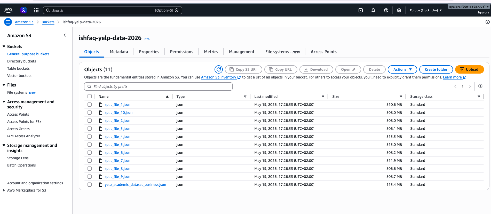
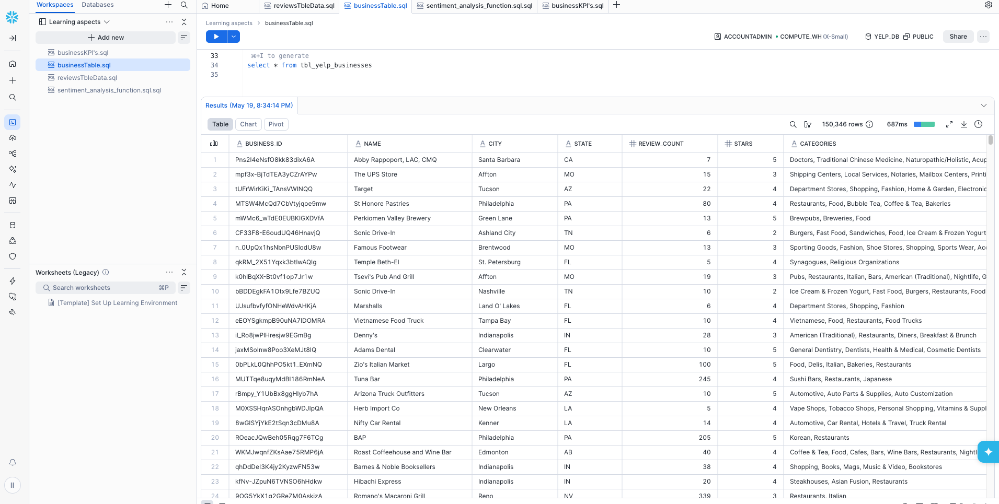
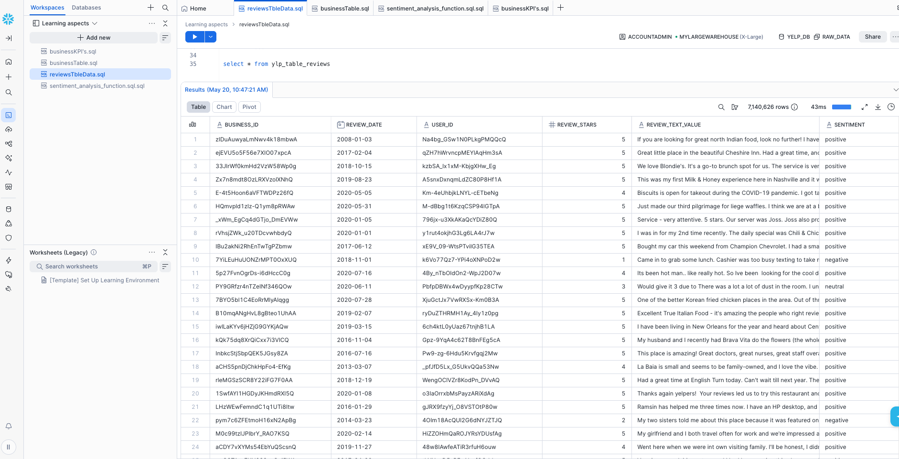
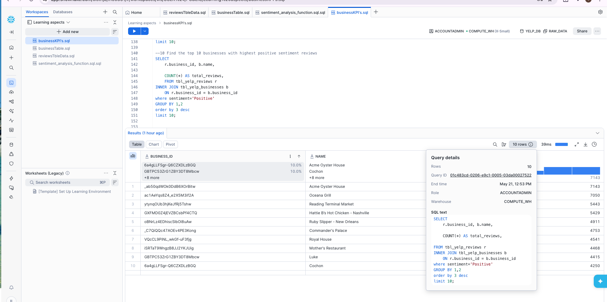

# End-to-End Yelp Review Sentiment Analysis using Python, AWS S3, and Snowflake

## Project Overview

This project demonstrates an end-to-end cloud-based data engineering and analytics pipeline using the Yelp Open Dataset.

The project covers:
- Processing large semi-structured JSON datasets
- Uploading data to AWS S3
- Loading and flattening JSON data in Snowflake
- Performing sentiment analysis using Python UDFs
- Creating business KPI dashboards using SQL analytics

The project processes more than **7 million Yelp reviews** and performs real-world business analytics on restaurant and business review data.

---

## Architecture

Yelp JSON Dataset → Python Processing → AWS S3 → Snowflake → Sentiment Analysis → SQL KPI Analysis

---

## Architecture Diagram


---

## Technologies Used

- Python
- AWS S3
- Snowflake
- SQL
- Python UDF
- TextBlob
- JSON
- Snowflake VARIANT Data Type
- Window Functions
- CTEs
- Joins & Aggregations

---

## Dataset Source

### Yelp Open Dataset
https://business.yelp.com/data/resources/open-dataset/

### Yelp Data Resources
https://business.yelp.com/data/resources/pricing/

---

## Project Workflow

### 1. Data Collection
- Downloaded Yelp Open Dataset JSON files
- Review dataset size: ~5GB+
- Business dataset size: ~100MB

### 2. Data Processing using Python
- Split large JSON review files into smaller chunks
- Prepared datasets for cloud upload

### 3. Cloud Storage using AWS S3
- Uploaded processed Yelp datasets to Amazon S3
- Used S3 as staging storage for Snowflake ingestion

---

## AWS S3 Bucket



---

## 4. Snowflake Data Warehouse
- Created databases and schemas
- Loaded JSON data from S3 into Snowflake
- Flattened semi-structured JSON data using Snowflake SQL

### Business Table Output



### Review Table with Sentiment Analysis



---

## 5. Sentiment Analysis using Python UDF

Implemented custom sentiment analysis inside Snowflake using:
- Python UDF
- TextBlob package

Reviews were classified into:
- Positive
- Neutral
- Negative

---

## 6. Business KPI Analysis

Created analytical KPI queries using Snowflake SQL.

KPIs include:
- Number of businesses in each category
- Top reviewed businesses
- Most active Yelp users
- Top restaurant reviewers
- 5-star review percentages
- City-wise business analysis
- Most recent reviews
- Businesses with highest positive sentiment reviews

### KPI Analysis Example



---

## Snowflake Features Used

- VARIANT Data Type
- LATERAL SPLIT_TO_TABLE
- Window Functions
- Common Table Expressions (CTEs)
- Python UDFs
- Aggregations
- Joins
- Sentiment Classification

---

## Folder Structure

```text
yelp-sentiment-analysis/
│
├── sql/
│   ├── 01_data_loading.sql
│   ├── 02_business_table_creation.sql
│   ├── 03_sentiment_analysis_udf.sql
│   └── 04_business_kpis.sql
│
├── screenshots/
│   ├── aws_s3_bucket.png
│   ├── business_table_output.png
│   ├── reviews_table_output.png
│   └── top_positive_businesses_kpi.png
│
├── architecture/
│   └── architecture_diagram.png
│
├── python/
│   └── split_large_json.py
│
└── README.md
